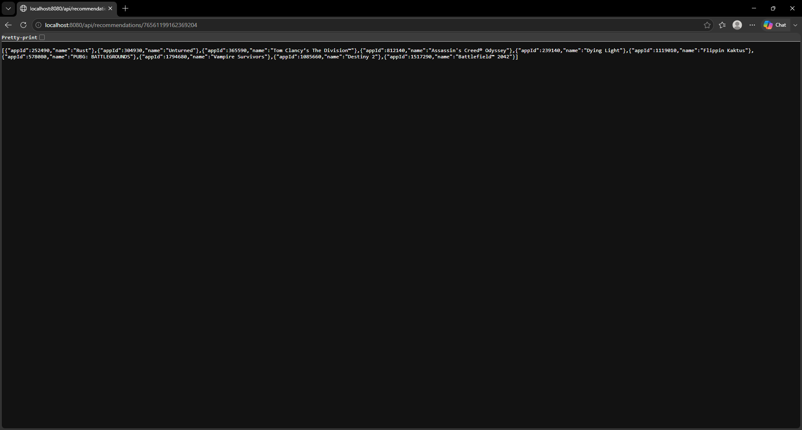

# SteamInsights

A REST API that pulls Steam player data and recommends games based on genre overlap with your library.

## What it does
User hits an endpoint using either a SteamID or appID to retrieve relevant information. Users can get a player summary,
owned games, details of a game, genre preferences, or game recommendations based on their library. All information is 
pulled from Steam APIs.

## Endpoints
### Player Summary
`GET  /api/players/{steamId}`
### Owned Games
`GET  /api/players/{steamId}/games`
### App Details
`GET  /api/games/{appId}`
### Genre Preferences Profile
`GET  /api/recommendations/{steamId}/preferences`
### Recommended games
`GET  /api/recommendations/{steamId}?topN=`

## Example
`GET /api/recommendations/76561198012345678`



## Setup

Requires Java 17 and a [Steam Web API key](https://steamcommunity.com/dev/apikey).

1. Set your API key as an environment variable: 
```bash
export STEAM_API_KEY=your_key_here
```
2. Run the app: ```./mvnw spring-boot:run```

3. The API is available at http://localhost:8080

## In-progress
1. Simple frontend
2. Database for games to reduce api calls

